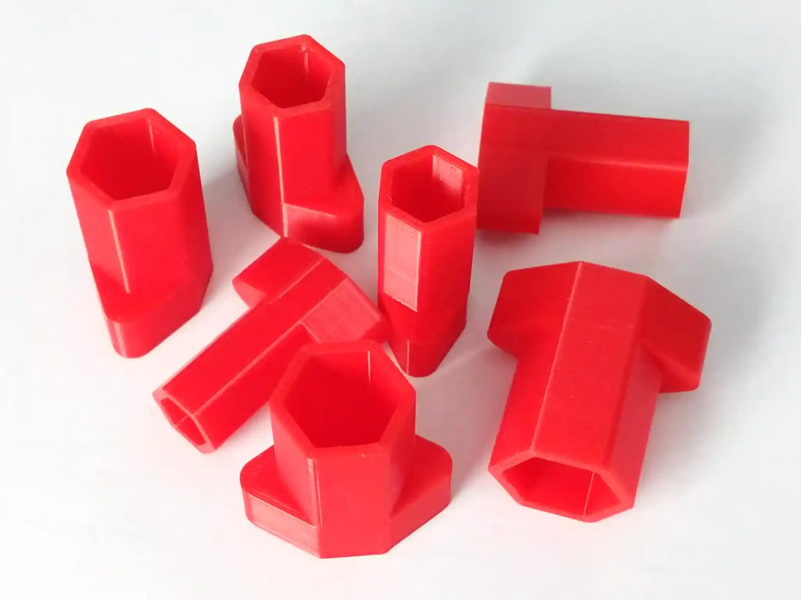
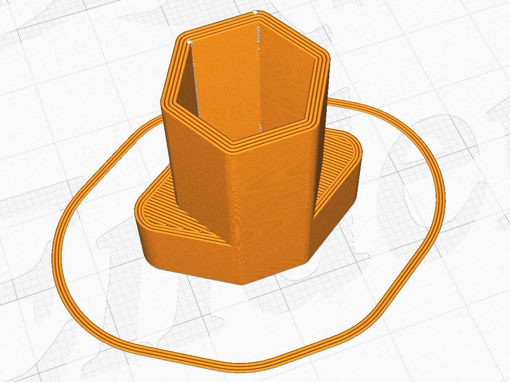

# Hex sockets

This is a set of sockets in common sizes needed for metric and inch sizes,
optimised to be comfortable to use, fast to print, and robust.

They are designed with thickness and radii to be printed with a 0.4 mm nozzle.
This will give solid walls that can be printed in continuous lines.

Each socket is 0.2mm larger than its nominal size to accommodate inexactness
when printing.

The following sizes are included:

- 7 mm
- 8 mm (also usable for 5/16" = 7.9 mm)
- 9.5 mm (for 3/8")
- 10 mm
- 11 mm (also usable for 7/16" = 11.1 mm)
- 12 mm
- 12.7 mm (1/2")
- 14 mm
- 15 mm

To make the STL files, run `make`.
